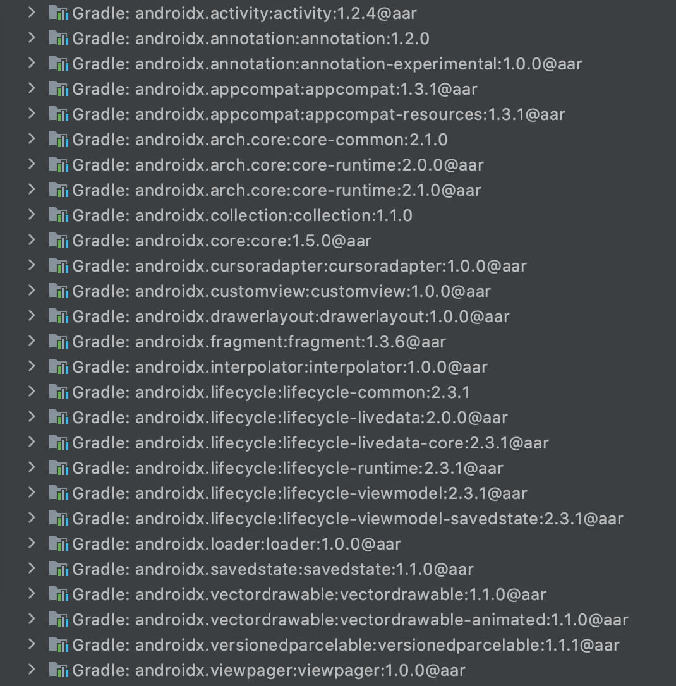
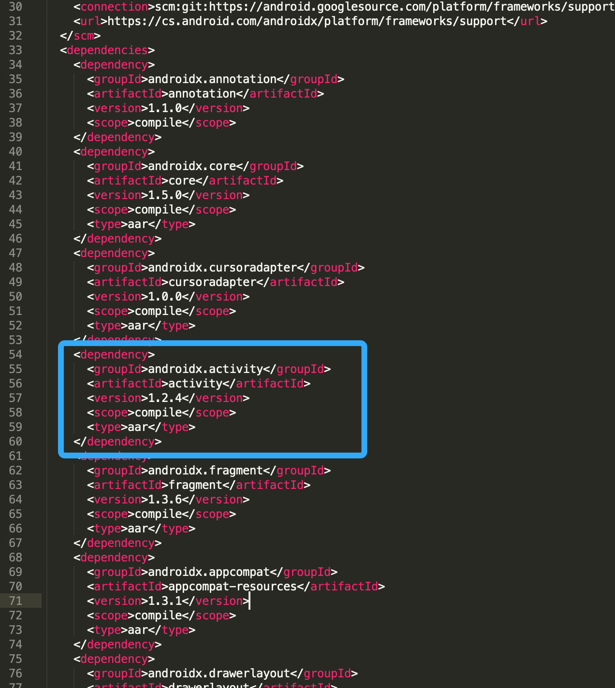

## 概念梳理——AndroidX

参考：

[1. 郭霖：总是听到有人说AndroidX，到底什么是AndroidX？](https://blog.csdn.net/guolin_blog/article/details/97142065)

[2. Jetpack 是什么？](https://zhuanlan.zhihu.com/p/334350927)

总的来说，AndroidX是将之前的Support Library进行了一次整合升级形成的一个API包，当我们迁移到AndroidX之后，将会发现我们用的所有Android相关API总体分为两个包：

* android.*：该包下的API都是随着Android系统版本发布的API。

* androidx.*包：该包下的API都是随着扩展库发布的，后续的扩展API也都将在此包中呈现。

一个完整的AndroidX依赖如下：

```java
dependencies {
    implementation 'androidx.appcompat:appcompat:1.3.1'
}
```

当我们引用`androidx.appcompat`库并同步之后，可以在依赖目录中发现如下情形：



可以看到，我们只需要引用`androidx.appcompat`库，该库会自动帮我们引用一大堆库androidx下的其他库，相当于一个appcompat套件。

但要注意的是，这些套件中附加依赖下来的库并非每个都是最新的版本，比如笔者写这到这时，`androidx.activity`库当前的版本是1.3.0，相比appcompat套件里的1.2.4版本肯定是有很多改进的。

那么我们想用新的`androidx.activity`库怎么办呢，其实这些库也可以单独声明版本号的，比如，我们手动指定依赖1.3.0版本的`androidx.activity`库，如下：

```java
dependencies {
    implementation 'androidx.appcompat:appcompat:1.3.1'
    // 手动指定activity库的版本
    implementation "androidx.activity:activity:1.3.0"
}
```

其实我们这些套件库，是在`appcompat-1.3.1.pom`文件中指定的，当我们打开Users/userName/.gradle/caches/modules-2/files-2.1，找到androidx.appcompat文件夹，就能看到appcompat-1.3.1.pom文件，打开就可以看到其中引用`androidx.activity`库并指定了1.2.4版本。



此外，AndroidX还有几十个未被默认引入的库，例如[recyclerview](https://developer.android.google.cn/jetpack/androidx/releases/recyclerview)、[viewpager2](https://developer.android.google.cn/jetpack/androidx/releases/viewpager2)等，有需要则可以单独声明依赖。

具体这些库都是干什么的，可以参考下面这篇文章：